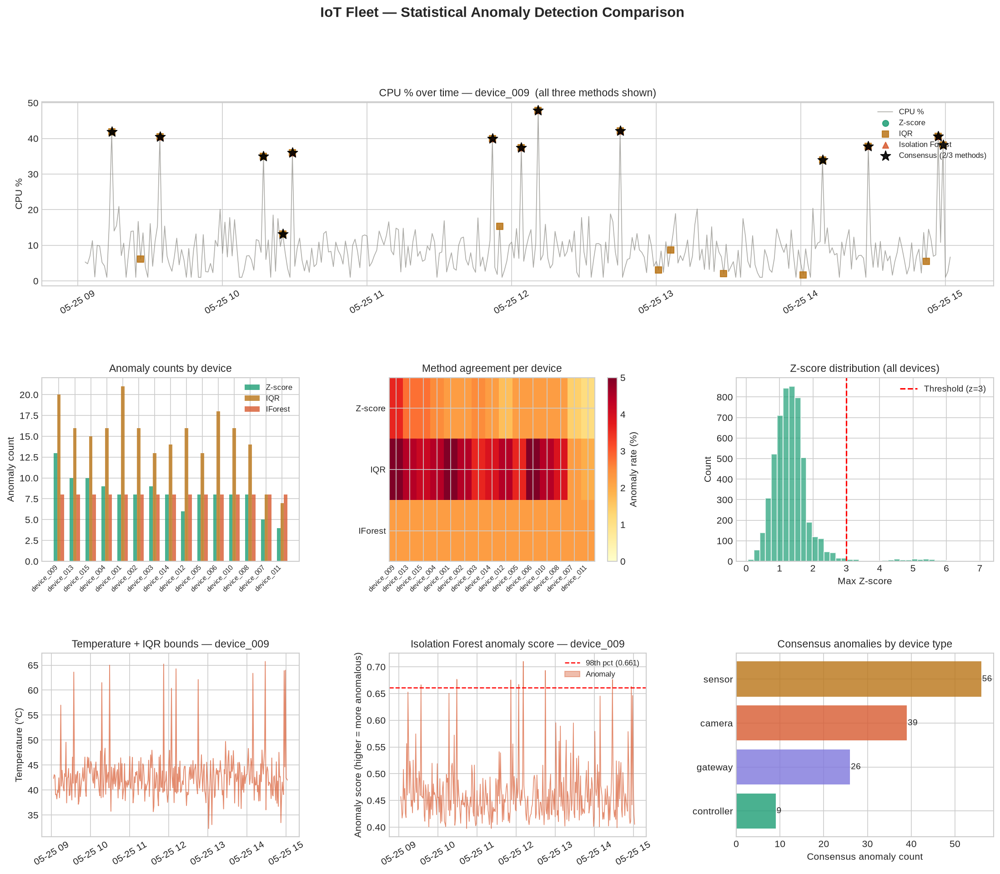
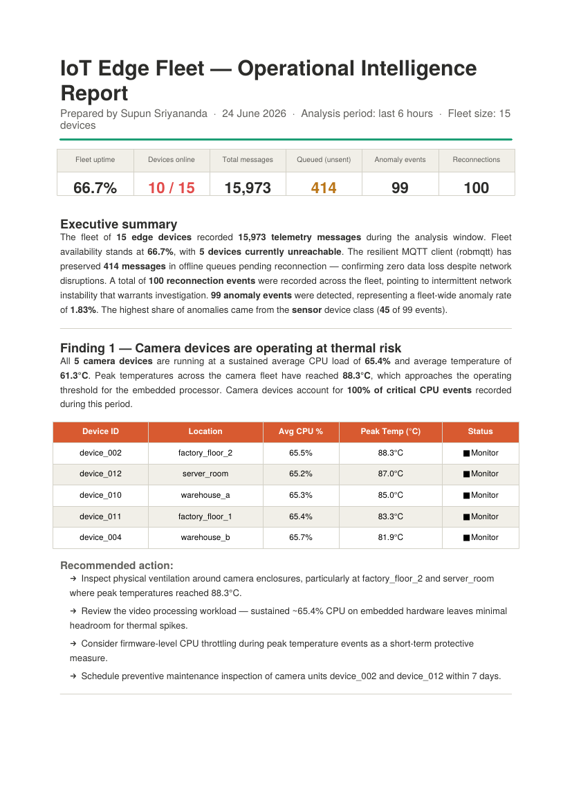
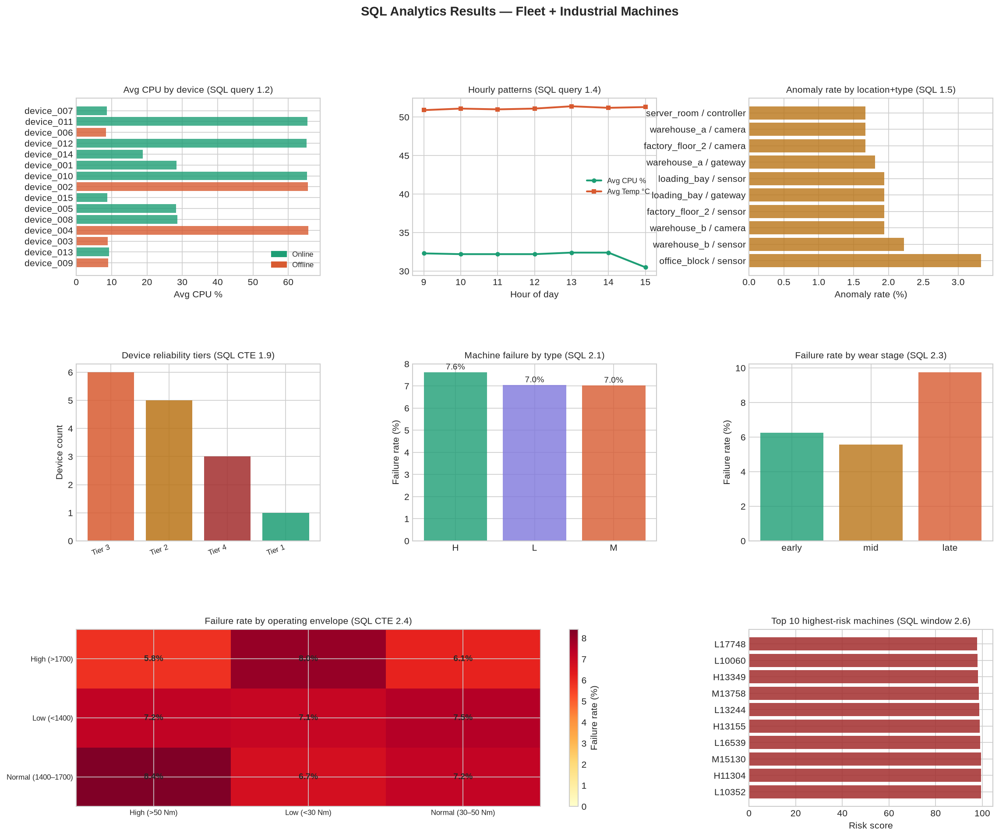
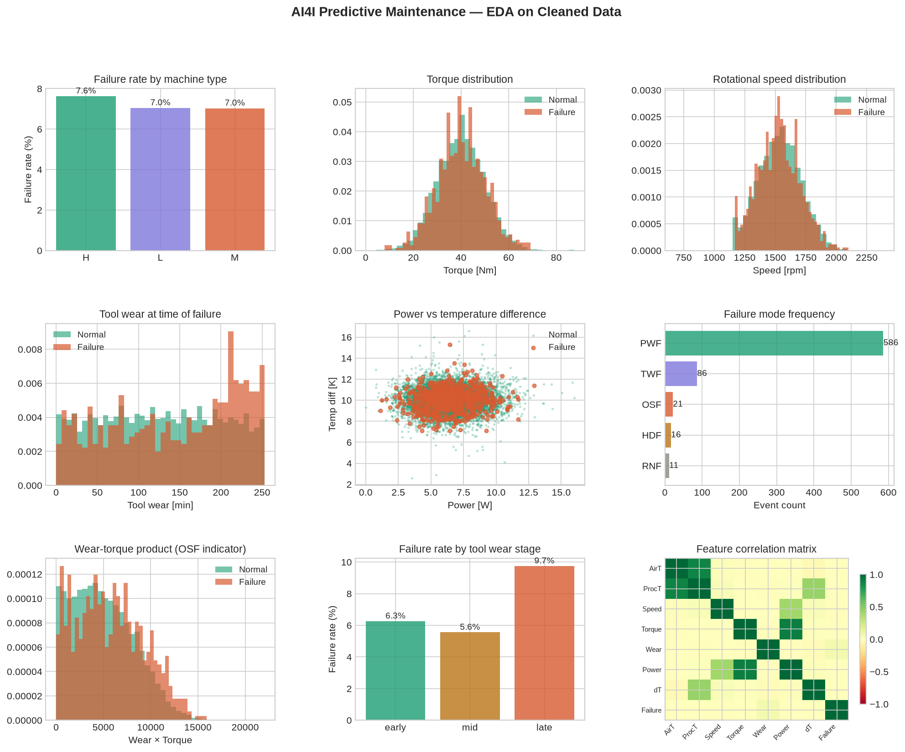
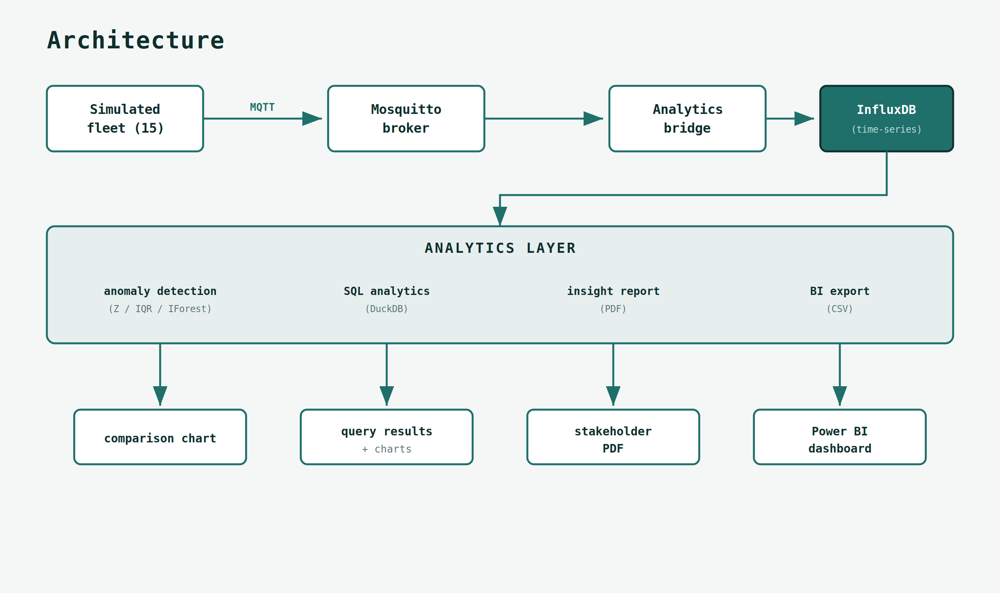

# Fleet Analytics — IoT Telemetry Pipeline & Predictive Maintenance

This is an end-to-end data pipeline for a fleet of IoT edge devices. Starting from resilient
telemetry ingestion, through statistical and machine-learning anomaly detection,
to SQL analytics, automated PDF reporting, and BI-ready exports.

This was built around a simulated fleet of 15 edge devices (Raspberry Pi-class). It 
contains the usual workflow of a full analysis — **ingest → store → detect →
analyse → communicate** — on realistic, messy time-series data.

> **Skills and Tools:** Python · pandas · NumPy · scikit-learn · SciPy ·
> SQL (window functions, CTEs, DuckDB) · time-series analysis · anomaly detection ·
> data cleaning · automated reporting (ReportLab) · Power BI data modelling ·
> MQTT / InfluxDB / Grafana · Docker

---

## Sample output:

**Statistical + ML anomaly detection** — three methods compared, with consensus scoring:



**Automated insight report** — analysis turned into a one-page stakeholder narrative:



**SQL analytics suite** — fleet and industrial queries (window functions, CTEs, risk ranking):



**Data-cleaning EDA** — exploratory analysis on the cleaned AI4I predictive-maintenance dataset:



---

## The project outcomes:

| Stage | Module | Oucomes |
|-------|--------|------------------|
| **Ingest** | `simulators/`, `bridge/` | Simulated fleet telemetry over MQTT, buffered into InfluxDB |
| **Detect** | `analysis/anomaly_detection/` | Z-score, IQR, and Isolation Forest anomaly detection with method comparison |
| **Analyse (Python)** | `analysis/fleet_analysis.py` | Fleet health summary + per-device trend charts |
| **Analyse (SQL)** | `sql/` | 16 analytical queries (window functions, CTEs) run in DuckDB |
| **Clean (ML)** | `notebooks/` | A data-cleaning notebook on the AI4I predictive-maintenance dataset |
| **Report** | `analysis/generate_insight_report.py` | A one-page PDF business-insight narrative |
| **BI export** | `powerbi/export_for_powerbi.py` | Four Power BI-ready CSVs (telemetry, status, events, summary) |

---

## Highlights:

**Statistical + ML anomaly detection (`analysis/anomaly_detection/`).**
Three methods are used here. Z-score (fast, assumes normality), IQR (robust to
skew), and Isolation Forest (multi-dimensional, ML-based). 
The reason behind using multiple methods is, to highlight which method
fits which data shape, and why.

**SQL analytics in DuckDB (`sql/`).**
Sixteen annotated analytical queries covering window functions (`RANK`, `LAG`,
running totals, `NTILE`), multi-step CTE chains, correlated subqueries, and
multi-dimensional bucketing. Across both the device fleet and the AI4I
industrial dataset. Runs in-process via DuckDB (so, no database server required).

**Automated insight reporting (`analysis/generate_insight_report.py`).**
The analysis is converted to a PDF. It is written for a stackeholder, not an engineer.
It contains: findings, recommendations, and prioritised actions. 
The purpose of the report is to explain 'what this means'.

**Data cleaning notebook (`notebooks/`).**
A structured, problem-by-problem clean of the AI4I 2020 predictive-maintenance
dataset with type coercion, missing-value handling, outlier treatment, and feature
engineering that exposes the physics behind each failure mode.

---

## How to run the project:

### Option A — explore the analytics without any infrastructure

This is the fastest way to see the project work. Uses the committed sample data and no
broker a database, or a cloud account are needed.

```bash
git clone https://github.com/ranaweerasupun/fleet-analytics.git
cd fleet-analytics

python -m venv .venv && source .venv/bin/activate   # Windows: .venv\Scripts\activate
pip install -r requirements.txt

# 1. Generate the PDF insight report from sample data
python analysis/generate_insight_report.py --data powerbi/sample_data

# 2. Run the SQL analytics suite (fleet queries work out of the box)
cd sql && python run_sql_analytics.py --queries fleet
```

### Option B — run the full live pipeline

Spins up the broker, time-series database, and dashboard, then runs the
simulated fleet.

```bash
cp .env.example .env        # then edit .env with your own values
docker compose up -d        # starts Mosquitto, InfluxDB, Grafana

python simulators/fleet_simulator.py   # generate live telemetry
python bridge/analytics_bridge.py      # forward MQTT -> InfluxDB

# once data is flowing:
python analysis/fleet_analysis.py
python analysis/anomaly_detection/anomaly_analysis.py
python powerbi/export_for_powerbi.py
```

---

## Architecture:



---

## Repository layout:

```
fleet-analytics/
├── simulators/          Simulated IoT fleet (MQTT publishers)
├── bridge/              MQTT -> InfluxDB forwarding
├── analysis/
│   ├── fleet_analysis.py            Fleet health + trend charts
│   ├── generate_insight_report.py   One-page PDF insight report
│   └── anomaly_detection/           Z-score / IQR / Isolation Forest
├── sql/                 DuckDB analytics — 16 queries, schema, runner
├── notebooks/           AI4I data-cleaning notebook (ML-style)
├── powerbi/             Power BI CSV export + sample data
├── grafana/             Grafana provisioning
|–– docs/images          Output inamges
├── docker-compose.yml   Mosquitto + InfluxDB + Grafana stack
└── requirements.txt
```

---

## Tech stack used:

**Language & analysis:** Python, pandas, NumPy, scikit-learn, SciPy
**SQL:** DuckDB (window functions, CTEs, analytical queries)
**Data store & messaging:** InfluxDB, MQTT (Mosquitto)
**Reporting & BI:** ReportLab (PDF), Power BI (CSV exports), Matplotlib
**Infrastructure:** Docker Compose, Grafana

---

## Notes

- Sample data is committed under `powerbi/sample_data/`, so the analytics and
  reporting modules can run without any live infrastructure.
- The SQL module's machine-domain queries (`--queries machines` / `all`) require
  the cleaned AI4I dataset produced by the notebook in `notebooks/`. The fleet
  queries (`--queries fleet`) run against the committed sample data directly.
- Secrets live in `.env` (gitignored); created `.env.example` for the expected keys.
- `analysis/fleet_analysis.py` reads from a live InfluxDB instance and requires
  the full stack (Option B). The other analytics modules run offline against the
  committed sample data.
